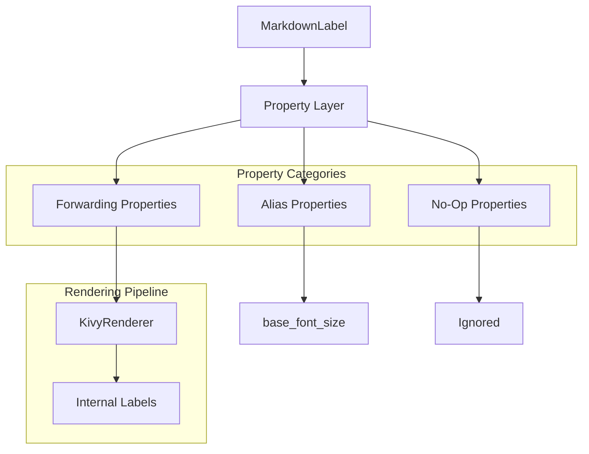

# Design Document: MarkdownLabel Label Compatibility

## Overview

This feature enhances `MarkdownLabel` to accept and respond to properties from Kivy's standard `Label` widget, enabling near drop-in compatibility. The implementation uses three strategies:

1. **Property Aliases**: Properties that map directly to existing MarkdownLabel properties (e.g., `font_size` → `base_font_size`)
2. **Property Forwarders**: Properties that propagate values to internal Label widgets during rendering
3. **No-Op Properties**: Properties accepted for API compatibility but ignored (e.g., `bold`, `italic`)

The design maintains Markdown-specific behavior while allowing developers to use familiar Label property names.

## Architecture



### Property Flow

| Category | Properties | Behavior |
|----------|-----------|----------|
| Alias | `font_size` | Maps to `base_font_size` bidirectionally |
| Forwarding | `font_name`, `color`, `line_height`, `halign`, `valign`, `padding`, `text_size`, `unicode_errors`, `strip`, `font_family`, `font_context`, `font_features`, `font_hinting`, `font_kerning`, `font_blended`, `disabled_color` | Passed to KivyRenderer and applied to internal Labels |
| No-Op | `bold`, `italic`, `underline`, `strikethrough`, `markup` | Accepted but ignored |

## Components and Interfaces

### Enhanced MarkdownLabel Widget

```python
class MarkdownLabel(BoxLayout):
    """Enhanced MarkdownLabel with Label-compatible properties."""
    
    # Existing properties
    text = StringProperty('')
    base_font_size = NumericProperty(15)
    code_font_name = StringProperty('RobotoMono-Regular')
    link_color = ColorProperty([0, 0.5, 1, 1])
    code_bg_color = ColorProperty([0.15, 0.15, 0.15, 1])
    
    # NEW: Alias property
    font_size = AliasProperty(
        getter=lambda self: self.base_font_size,
        setter=lambda self, v: setattr(self, 'base_font_size', v),
        bind=['base_font_size']
    )
    
    # NEW: Forwarding properties
    font_name = StringProperty('Roboto')
    color = ColorProperty([1, 1, 1, 1])
    line_height = NumericProperty(1.0)
    halign = OptionProperty('auto', options=['left', 'center', 'right', 'justify', 'auto'])
    valign = OptionProperty('bottom', options=['bottom', 'middle', 'center', 'top'])
    padding = VariableListProperty([0, 0, 0, 0])
    text_size = ListProperty([None, None])
    unicode_errors = OptionProperty('replace', options=['strict', 'replace', 'ignore'])
    strip = BooleanProperty(False)
    disabled_color = ColorProperty([1, 1, 1, 0.3])
    
    # NEW: Advanced font properties
    font_family = StringProperty(None, allownone=True)
    font_context = StringProperty(None, allownone=True)
    font_features = StringProperty('')
    font_hinting = OptionProperty('normal', options=[None, 'normal', 'light', 'mono'], allownone=True)
    font_kerning = BooleanProperty(True)
    font_blended = BooleanProperty(True)
    
    # NEW: Truncation properties
    shorten = BooleanProperty(False)
    max_lines = NumericProperty(0)
    shorten_from = OptionProperty('center', options=['left', 'center', 'right'])
    split_str = StringProperty('')
    
    # NEW: No-op properties (accepted but ignored)
    bold = BooleanProperty(False)
    italic = BooleanProperty(False)
    underline = BooleanProperty(False)
    strikethrough = BooleanProperty(False)
    markup = BooleanProperty(True)  # Always True for MarkdownLabel
```

### Enhanced KivyRenderer

```python
class KivyRenderer(BaseRenderer):
    """Renderer with Label-compatible property support."""
    
    def __init__(self,
                 base_font_size: float = 15,
                 code_font_name: str = 'RobotoMono-Regular',
                 link_color: List[float] = None,
                 code_bg_color: List[float] = None,
                 # NEW: Label-compatible properties
                 font_name: str = 'Roboto',
                 color: List[float] = None,
                 line_height: float = 1.0,
                 halign: str = 'auto',
                 valign: str = 'bottom',
                 text_size: List = None,
                 unicode_errors: str = 'replace',
                 strip: bool = False,
                 font_family: str = None,
                 font_context: str = None,
                 font_features: str = '',
                 font_hinting: str = 'normal',
                 font_kerning: bool = True,
                 font_blended: bool = True,
                 shorten: bool = False,
                 max_lines: int = 0,
                 shorten_from: str = 'center',
                 split_str: str = ''):
        pass
    
    def _create_label(self, text: str, **kwargs) -> Label:
        """Create a Label with forwarded properties applied."""
        # Apply all forwarding properties as defaults
        # Allow kwargs to override for specific cases (e.g., code blocks)
        pass
```

## Data Models

### Property Configuration

```python
# Properties that trigger widget rebuild when changed
REBUILD_PROPERTIES = [
    'text', 'base_font_size', 'font_name', 'color', 'line_height',
    'halign', 'valign', 'text_size', 'unicode_errors', 'strip',
    'font_family', 'font_context', 'font_features', 'font_hinting',
    'font_kerning', 'font_blended', 'shorten', 'max_lines',
    'shorten_from', 'split_str', 'code_font_name', 'link_color',
    'code_bg_color', 'disabled', 'disabled_color'
]

# Properties that are no-ops (accepted but ignored)
NOOP_PROPERTIES = ['bold', 'italic', 'underline', 'strikethrough', 'markup']

# Property defaults matching Kivy Label
LABEL_DEFAULTS = {
    'font_name': 'Roboto',
    'color': [1, 1, 1, 1],
    'line_height': 1.0,
    'halign': 'auto',
    'valign': 'bottom',
    'padding': [0, 0, 0, 0],
    'text_size': [None, None],
    'unicode_errors': 'replace',
    'strip': False,
    'disabled_color': [1, 1, 1, 0.3],
    'font_family': None,
    'font_context': None,
    'font_features': '',
    'font_hinting': 'normal',
    'font_kerning': True,
    'font_blended': True,
    'shorten': False,
    'max_lines': 0,
    'shorten_from': 'center',
    'split_str': '',
}
```

### Label Property Application

| Property | Applied To | Notes |
|----------|-----------|-------|
| `font_name` | All internal Labels except code | Code uses `code_font_name` |
| `color` | All body text Labels | Links use `link_color` |
| `line_height` | All internal Labels | Affects line spacing |
| `halign` | Paragraphs, headings | 'auto' → 'left' |
| `valign` | All internal Labels | Vertical alignment |
| `text_size` | All internal Labels | Width constraint for wrapping |
| `unicode_errors` | All internal Labels | Error handling mode |
| `strip` | All internal Labels | Whitespace handling |
| `font_*` | All internal Labels | Advanced typography |
| `shorten`, `max_lines`, etc. | All internal Labels | Truncation behavior |

## Correctness Properties

*A property is a characteristic or behavior that should hold true across all valid executions of a system-essentially, a formal statement about what the system should do. Properties serve as the bridge between human-readable specifications and machine-verifiable correctness guarantees.*

### Property 1: font_size/base_font_size Alias Bidirectionality
*For any* numeric value V, setting `font_size` to V SHALL result in `base_font_size` equaling V, and setting `base_font_size` to V SHALL result in `font_size` returning V.
**Validates: Requirements 2.1, 2.2**

### Property 2: font_name Forwarding with Code Preservation
*For any* Markdown text containing both regular text and code blocks, and any font_name value, all non-code internal Labels SHALL have `font_name` set to the specified value, while code Labels SHALL retain `code_font_name`.
**Validates: Requirements 1.1, 1.3**

### Property 3: color Forwarding with Link Preservation
*For any* Markdown text containing both regular text and links, and any color value, all body text Labels SHALL have `color` set to the specified value, while link text SHALL retain `link_color` styling.
**Validates: Requirements 3.1, 3.2**

### Property 4: line_height Forwarding
*For any* Markdown text and any line_height value, all internal Labels SHALL have `line_height` set to the specified value.
**Validates: Requirements 4.1**

### Property 5: halign Forwarding
*For any* Markdown text with paragraphs or headings, and any halign value in ['left', 'center', 'right', 'justify'], all paragraph and heading Labels SHALL have `halign` set to that value. When halign is 'auto', Labels SHALL have `halign` set to 'left'.
**Validates: Requirements 5.1, 5.2**

### Property 6: valign Forwarding
*For any* Markdown text and any valign value in ['top', 'middle', 'center', 'bottom'], all applicable internal Labels SHALL have `valign` set to that value.
**Validates: Requirements 6.1, 6.2**

### Property 7: padding Application
*For any* padding value (single, two-element, or four-element list), the MarkdownLabel container SHALL have `padding` set to the normalized four-element form.
**Validates: Requirements 7.1, 7.2, 7.3, 7.4**

### Property 8: No-Op Properties Acceptance
*For any* boolean value, setting `bold`, `italic`, `underline`, `strikethrough`, or `markup` on MarkdownLabel SHALL NOT raise an exception, and the rendered output SHALL be identical regardless of these property values.
**Validates: Requirements 8.1, 8.2, 8.3, 8.4, 8.5, 8.6**

### Property 9: text_size Width Constraint Forwarding
*For any* Markdown text and any text_size with a non-None width, all internal Labels SHALL have `text_size[0]` set to that width value.
**Validates: Requirements 9.1**

### Property 10: unicode_errors Forwarding
*For any* unicode_errors value in ['strict', 'replace', 'ignore'], all internal Labels SHALL have `unicode_errors` set to that value.
**Validates: Requirements 10.1, 10.2**

### Property 11: Advanced Font Properties Forwarding
*For any* values of `font_family`, `font_context`, `font_features`, `font_hinting`, `font_kerning`, or `font_blended`, all internal Labels SHALL have those properties set to the corresponding values.
**Validates: Requirements 11.1, 11.2, 11.3, 11.4, 11.5, 11.6**

### Property 12: disabled_color Application
*For any* MarkdownLabel with `disabled=True` and any `disabled_color` value, all internal Labels SHALL use `disabled_color` instead of `color`.
**Validates: Requirements 12.1, 12.2**

### Property 13: strip Forwarding
*For any* Markdown text and any strip boolean value, all internal Labels SHALL have `strip` set to that value.
**Validates: Requirements 14.1**

### Property 14: Reactive Rebuild on Property Change
*For any* forwarding property change after initial rendering, the widget tree SHALL be rebuilt with the new property value applied to all relevant internal Labels.
**Validates: Requirements 1.2, 3.3, 4.2, 9.3**

## Error Handling

| Error Condition | Handling Strategy |
|-----------------|-------------------|
| Invalid property value type | Kivy property validation raises ValueError |
| Invalid option value | OptionProperty raises ValueError |
| None for non-nullable property | Property validation handles |
| Conflicting properties | Later-set property wins |

## Testing Strategy

### Dual Testing Approach

- **Unit tests**: Verify specific property behaviors and edge cases
- **Property-based tests**: Verify universal properties hold across all valid inputs

### Property-Based Testing Framework

The project uses **Hypothesis** for Python property-based testing.

Configuration:
- Minimum 100 iterations per property test
- Custom generators for property values and Markdown content
- Shrinking enabled for minimal failing examples

### Test Annotation Format

Each property-based test MUST be annotated with:
```python
# **Feature: label-compatibility, Property {number}: {property_text}**
```

### Custom Generators

```python
from hypothesis import strategies as st

# Generate valid font sizes
font_sizes = st.floats(min_value=1, max_value=200, allow_nan=False)

# Generate valid colors
colors = st.lists(
    st.floats(min_value=0, max_value=1),
    min_size=4, max_size=4
)

# Generate valid halign values
halign_values = st.sampled_from(['left', 'center', 'right', 'justify', 'auto'])

# Generate valid padding
padding_values = st.one_of(
    st.lists(st.floats(min_value=0, max_value=100), min_size=1, max_size=1),
    st.lists(st.floats(min_value=0, max_value=100), min_size=2, max_size=2),
    st.lists(st.floats(min_value=0, max_value=100), min_size=4, max_size=4),
)

# Generate simple Markdown with various elements
simple_markdown = st.one_of(
    st.text(min_size=1, max_size=100),  # Plain text
    st.builds(lambda t: f'# {t}', st.text(min_size=1, max_size=50)),  # Heading
    st.builds(lambda t: f'`{t}`', st.text(min_size=1, max_size=20)),  # Code
    st.builds(lambda t, u: f'[{t}]({u})', st.text(min_size=1, max_size=20), st.text(min_size=1, max_size=30)),  # Link
)
```

### Unit Test Examples

```python
def test_font_size_alias_setter():
    """Verify font_size sets base_font_size."""
    label = MarkdownLabel(font_size=20)
    assert label.base_font_size == 20

def test_font_size_alias_getter():
    """Verify font_size returns base_font_size."""
    label = MarkdownLabel(base_font_size=25)
    assert label.font_size == 25

def test_noop_properties_no_error():
    """Verify no-op properties don't raise errors."""
    label = MarkdownLabel(
        text='Hello',
        bold=True,
        italic=True,
        underline=True,
        strikethrough=True,
        markup=False
    )
    # Should not raise
```
