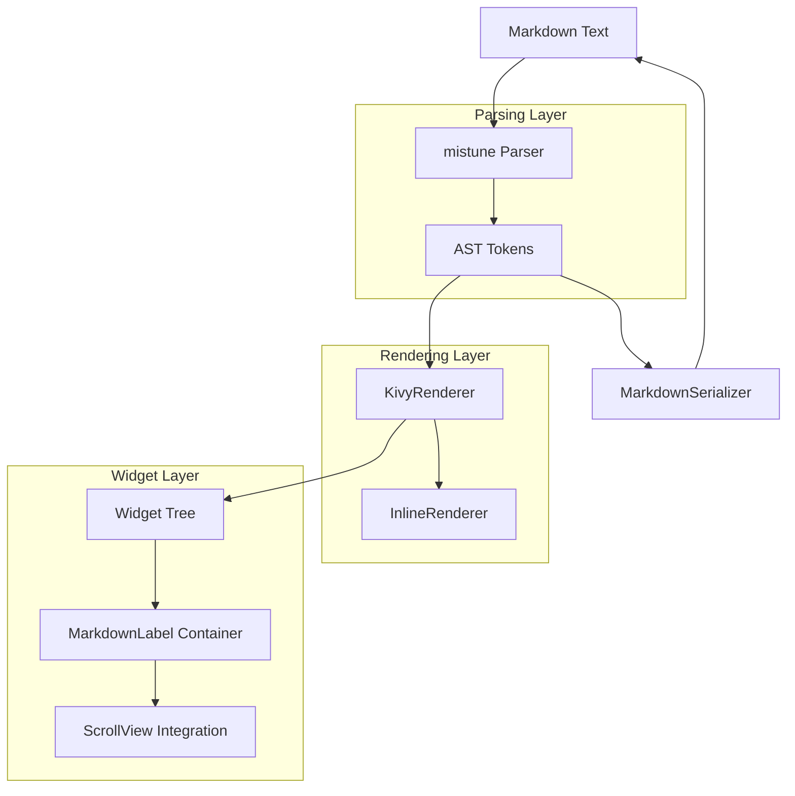

# Design Document: MarkdownLabel Kivy Flower

## Overview

The MarkdownLabel flower provides a Kivy widget that renders Markdown documents as interactive, styled widget trees. It bridges the gap between Markdown's simple text syntax and Kivy's rich UI capabilities by using the `mistune` library for parsing and a custom renderer (`KivyRenderer`) for widget generation.

The architecture follows a pipeline pattern:
1. **Parse**: Markdown text → AST (via mistune)
2. **Render**: AST → Kivy widget tree (via KivyRenderer)
3. **Display**: Widget tree integrated into Kivy app

Key design goals:
- Drop-in replacement API similar to Kivy's Label (`text` property)
- Support for all common Markdown elements (headings, lists, tables, code, links, images)
- Interactive elements (clickable links via `on_ref_press`)
- Auto-sizing for ScrollView integration
- Round-trip serialization for testing

## Architecture



### Component Responsibilities

| Component | Responsibility |
|-----------|---------------|
| `MarkdownLabel` | Main widget class, manages text property and widget lifecycle |
| `KivyRenderer` | Converts block-level AST nodes to Kivy widgets |
| `InlineRenderer` | Converts inline AST nodes to Kivy markup strings |
| `MarkdownSerializer` | Converts AST back to Markdown text for round-trip testing |

## Components and Interfaces

### MarkdownLabel Widget

```python
class MarkdownLabel(BoxLayout):
    """Main widget for rendering Markdown as Kivy UI."""
    
    text = StringProperty('')
    """Markdown text to render."""
    
    base_font_size = NumericProperty(15)
    """Base font size in sp for body text."""
    
    code_font_name = StringProperty('RobotoMono-Regular')
    """Font for code blocks and inline code."""
    
    link_color = ColorProperty([0, 0.5, 1, 1])
    """Color for link text."""
    
    code_bg_color = ColorProperty([0.15, 0.15, 0.15, 1])
    """Background color for code blocks."""
    
    __events__ = ('on_ref_press',)
    
    def on_ref_press(self, ref: str) -> None:
        """Dispatched when a link is clicked."""
        pass
    
    def get_ast(self) -> List[Dict[str, Any]]:
        """Return the parsed AST tokens."""
        pass
    
    def to_markdown(self) -> str:
        """Serialize the current AST back to Markdown text."""
        pass
```

### KivyRenderer

```python
class KivyRenderer(BaseRenderer):
    """Renders mistune AST to Kivy widgets."""
    
    NAME = "kivy"
    
    def __init__(self, 
                 base_font_size: float = 15,
                 code_font_name: str = 'RobotoMono-Regular',
                 link_color: List[float] = None,
                 code_bg_color: List[float] = None):
        pass
    
    def __call__(self, tokens: List[Dict], state: BlockState) -> BoxLayout:
        """Render tokens to a BoxLayout containing all widgets."""
        pass
    
    # Block-level renderers
    def paragraph(self, token: Dict, state: BlockState) -> Label:
        pass
    
    def heading(self, token: Dict, state: BlockState) -> Label:
        pass
    
    def list(self, token: Dict, state: BlockState) -> BoxLayout:
        pass
    
    def block_code(self, token: Dict, state: BlockState) -> Widget:
        pass
    
    def block_quote(self, token: Dict, state: BlockState) -> BoxLayout:
        pass
    
    def table(self, token: Dict, state: BlockState) -> GridLayout:
        pass
    
    def thematic_break(self, token: Dict, state: BlockState) -> Widget:
        pass
    
    def image(self, token: Dict, state: BlockState) -> Widget:
        pass
```

### InlineRenderer

```python
class InlineRenderer:
    """Converts inline AST tokens to Kivy markup strings."""
    
    def __init__(self, link_color: List[float] = None):
        pass
    
    def render(self, children: List[Dict]) -> str:
        """Render inline tokens to a Kivy markup string."""
        pass
    
    def text(self, token: Dict) -> str:
        pass
    
    def strong(self, token: Dict) -> str:
        pass
    
    def emphasis(self, token: Dict) -> str:
        pass
    
    def codespan(self, token: Dict) -> str:
        pass
    
    def strikethrough(self, token: Dict) -> str:
        pass
    
    def link(self, token: Dict) -> str:
        pass
    
    def softbreak(self, token: Dict) -> str:
        pass
    
    def linebreak(self, token: Dict) -> str:
        pass
```

### MarkdownSerializer

```python
class MarkdownSerializer:
    """Serializes AST tokens back to Markdown text."""
    
    def serialize(self, tokens: List[Dict]) -> str:
        """Convert AST tokens to Markdown string."""
        pass
    
    def paragraph(self, token: Dict) -> str:
        pass
    
    def heading(self, token: Dict) -> str:
        pass
    
    def list(self, token: Dict) -> str:
        pass
    
    def block_code(self, token: Dict) -> str:
        pass
    
    def block_quote(self, token: Dict) -> str:
        pass
    
    def table(self, token: Dict) -> str:
        pass
    
    def thematic_break(self, token: Dict) -> str:
        pass
    
    # Inline serializers
    def serialize_inline(self, children: List[Dict]) -> str:
        pass
```

## Data Models

### AST Token Structure (from mistune)

Mistune produces tokens as dictionaries with the following common structure:

```python
# Block tokens
{
    "type": "paragraph" | "heading" | "list" | "block_code" | "block_quote" | "table" | "thematic_break",
    "children": [...],  # For container types
    "text": "...",      # For leaf types
    "attrs": {...},     # Type-specific attributes
}

# Heading attrs
{"level": 1-6}

# List attrs  
{"ordered": bool, "start": int}

# Block code attrs
{"info": "language"}

# Table cell attrs
{"align": "left" | "center" | "right" | None, "head": bool}

# Inline tokens
{
    "type": "text" | "strong" | "emphasis" | "codespan" | "strikethrough" | "link" | "image",
    "children": [...],  # For container types
    "raw": "...",       # For text/codespan
    "attrs": {...},     # For link/image: {"url": "...", "title": "..."}
}
```

### Widget Mapping

| AST Type | Kivy Widget | Notes |
|----------|-------------|-------|
| Document root | `BoxLayout(orientation='vertical')` | Container for all blocks |
| `paragraph` | `Label(markup=True)` | Inline content as markup |
| `heading` | `Label(markup=True, font_size=...)` | Size based on level |
| `list` | `BoxLayout(orientation='vertical')` | Contains list items |
| `list_item` | `BoxLayout(orientation='horizontal')` | Bullet/number + content |
| `block_code` | `Label` + background `Widget` | Monospace, dark bg |
| `block_quote` | `BoxLayout` + left border | Indented, styled |
| `table` | `GridLayout(cols=n)` | Cells as Labels |
| `thematic_break` | `Widget` with canvas line | Horizontal rule |
| `image` | `AsyncImage` | Falls back to alt text |

## Correctness Properties

*A property is a characteristic or behavior that should hold true across all valid executions of a system-essentially, a formal statement about what the system should do. Properties serve as the bridge between human-readable specifications and machine-verifiable correctness guarantees.*

### Property 1: Widget Tree Generation
*For any* valid Markdown text, when parsed and rendered by MarkdownLabel, the resulting widget tree SHALL contain at least one child widget for each block-level element in the AST.
**Validates: Requirements 1.1**

### Property 2: Reactive Text Updates
*For any* two different Markdown texts, when the `text` property is changed from the first to the second, the widget tree SHALL reflect the structure of the second text, not the first.
**Validates: Requirements 1.2**

### Property 3: Heading Font Size Hierarchy
*For any* Markdown document containing headings of different levels, headings with smaller level numbers (e.g., h1) SHALL have larger font sizes than headings with larger level numbers (e.g., h6).
**Validates: Requirements 2.1**

### Property 4: Inline Formatting Conversion
*For any* Markdown text containing inline formatting (bold, italic, code, strikethrough), the rendered Kivy markup SHALL contain the corresponding tags: `**text**` → `[b]text[/b]`, `*text*` → `[i]text[/i]`, `` `code` `` → `[font=monospace]code[/font]`, `~~text~~` → `[s]text[/s]`.
**Validates: Requirements 3.2, 3.3, 3.4, 3.5**

### Property 5: Paragraph Markup Enabled
*For any* Markdown paragraph, the rendered Label widget SHALL have `markup=True`.
**Validates: Requirements 3.1**

### Property 6: List Structure Preservation
*For any* Markdown list (ordered or unordered), the rendered widget tree SHALL contain a BoxLayout with one child BoxLayout per list item, and each item SHALL be prefixed with the appropriate marker (bullet or number).
**Validates: Requirements 4.1, 4.2**

### Property 7: Nested List Indentation
*For any* Markdown list containing nested lists, each nesting level SHALL increase the left padding/indentation of the nested content.
**Validates: Requirements 4.3**

### Property 8: Table Grid Structure
*For any* Markdown table with R rows and C columns, the rendered GridLayout SHALL have `cols=C` and contain exactly R×C Label widgets.
**Validates: Requirements 5.1**

### Property 9: Table Alignment Application
*For any* Markdown table cell with specified alignment (left, center, right), the corresponding Label widget SHALL have `halign` set to that alignment value.
**Validates: Requirements 5.2**

### Property 10: Code Block Styling
*For any* Markdown code block (fenced or indented), the rendered widget SHALL use a monospace font and have a dark background color applied.
**Validates: Requirements 6.1, 6.2**

### Property 11: Code Block Language Metadata
*For any* fenced code block with a language identifier, the rendered widget SHALL store the language string in an accessible attribute.
**Validates: Requirements 6.3**

### Property 12: Link Ref Markup
*For any* Markdown link `[text](url)`, the rendered Kivy markup SHALL contain `[ref=url]text[/ref]`.
**Validates: Requirements 7.1**

### Property 13: Image Widget Creation
*For any* Markdown image ``, the rendered widget tree SHALL contain an AsyncImage widget with `source=url`.
**Validates: Requirements 8.1**

### Property 14: Block Quote Structure
*For any* Markdown block quote, the rendered widget SHALL be a BoxLayout with left border styling and its content indented from the left edge.
**Validates: Requirements 9.1**

### Property 15: Thematic Break Rendering
*For any* Markdown thematic break (`---`, `***`, `___`), the rendered widget tree SHALL contain a Widget with a horizontal line drawn on its canvas.
**Validates: Requirements 10.1**

### Property 16: Auto-Sizing Behavior
*For any* MarkdownLabel with content, the widget SHALL have `size_hint_y=None` and its `height` SHALL equal or exceed the sum of its children's heights.
**Validates: Requirements 11.1**

### Property 17: Round-Trip Serialization
*For any* valid Markdown text M, if we parse M to AST A, serialize A back to Markdown M', and parse M' to AST A', then A and A' SHALL be semantically equivalent (same structure and content).
**Validates: Requirements 12.2, 12.3**

### Property 18: Deep Nesting Stability
*For any* Markdown with nesting depth up to 10 levels (nested lists, quotes), the MarkdownLabel SHALL render without raising exceptions or causing stack overflow.
**Validates: Requirements 13.1**

### Property 19: Special Character Escaping
*For any* Markdown text containing Kivy markup special characters (`[`, `]`, `&`), the rendered Label text SHALL properly escape them (`&bl;`, `&br;`, `&amp;`) to prevent markup injection.
**Validates: Requirements 13.3**

## Error Handling

| Error Condition | Handling Strategy |
|-----------------|-------------------|
| Empty text | Render empty BoxLayout container |
| Invalid Markdown | mistune handles gracefully, renders as plain text |
| Missing image | Display alt text in Label, log warning |
| Deep nesting (>10) | Render up to limit, truncate with warning |
| Kivy markup chars in text | Escape using `&bl;`, `&br;`, `&amp;` |
| Unknown AST token type | Skip with warning, continue rendering |

## Testing Strategy

### Dual Testing Approach

The MarkdownLabel flower uses both unit tests and property-based tests for comprehensive coverage:

- **Unit tests**: Verify specific examples, edge cases, and integration points
- **Property-based tests**: Verify universal properties hold across all valid inputs

### Property-Based Testing Framework

The project will use **Hypothesis** for Python property-based testing. Hypothesis is the standard PBT library for Python with excellent support for custom generators.

Configuration:
- Minimum 100 iterations per property test
- Custom generators for valid Markdown structures
- Shrinking enabled for minimal failing examples

### Test Annotation Format

Each property-based test MUST be annotated with:
```python
# **Feature: markdown-label, Property {number}: {property_text}**
```

### Test Categories

1. **Parsing Tests**
   - Verify AST structure matches expected for various Markdown inputs
   - Test edge cases: empty input, whitespace-only, special characters

2. **Rendering Tests**
   - Verify widget types match AST node types
   - Verify widget properties (font_size, markup, halign) are set correctly
   - Verify widget hierarchy matches AST hierarchy

3. **Round-Trip Tests**
   - Parse → Serialize → Parse produces equivalent AST
   - Critical for validating serializer correctness

4. **Integration Tests**
   - MarkdownLabel in ScrollView scrolls correctly
   - Link clicks dispatch on_ref_press events
   - Text property changes trigger re-render

### Custom Generators

```python
from hypothesis import strategies as st

# Generate valid Markdown text
markdown_text = st.recursive(
    st.text(alphabet=st.characters(blacklist_categories=['Cs'])),
    lambda children: st.one_of(
        # Headings
        st.builds(lambda level, text: '#' * level + ' ' + text, 
                  st.integers(1, 6), children),
        # Bold
        st.builds(lambda text: f'**{text}**', children),
        # Lists
        st.builds(lambda items: '\n'.join(f'- {item}' for item in items),
                  st.lists(children, min_size=1, max_size=5)),
        # etc.
    )
)
```

### Unit Test Examples

```python
def test_empty_text_renders_empty_container():
    """Verify empty text produces empty BoxLayout."""
    label = MarkdownLabel(text='')
    assert isinstance(label, BoxLayout)
    assert len(label.children) == 0

def test_heading_level_1_largest_font():
    """Verify h1 has largest font size."""
    label = MarkdownLabel(text='# Heading 1\n## Heading 2')
    h1_label = label.children[0]
    h2_label = label.children[1]
    assert h1_label.font_size > h2_label.font_size
```
