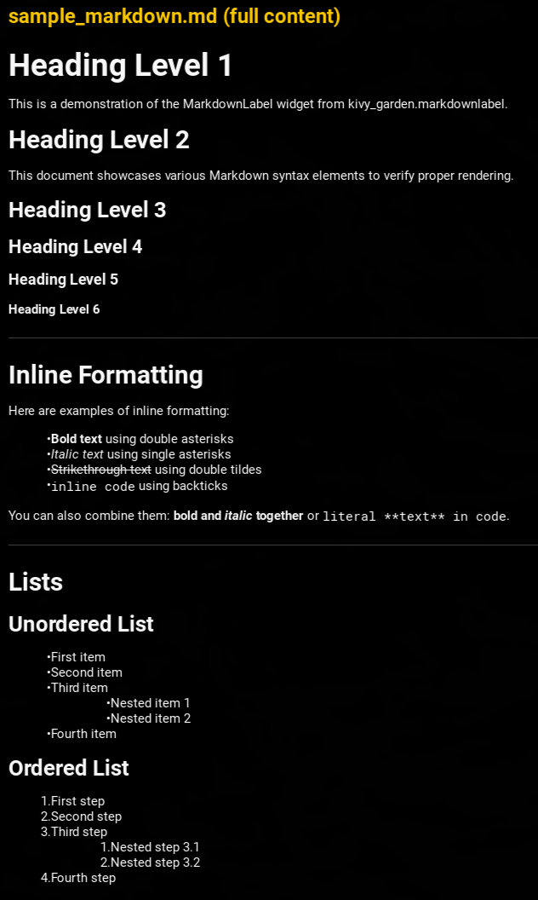

.. MarkdownLabel documentation master file

Welcome to MarkdownLabel's Documentation!
=========================================

**MarkdownLabel** is a Kivy widget that parses and renders Markdown documents as structured, interactive Kivy UI elements. It provides a Label-compatible API for common styling properties while supporting full Markdown syntax.

Key Features
------------

- **Full Markdown syntax support**: Headings, paragraphs, lists, tables, code blocks, block quotes, images
- **Inline formatting**: Bold, italic, strikethrough, inline code, links
- **Interactive links**: Handle clicks with the ``on_ref_press`` event
- **Customizable styling**: Fonts, colors, sizes, and more
- **Label API compatibility**: Easy migration from standard Kivy Labels
- **Built on mistune**: Modern Markdown parser with plugin support

Quick Example
-------------

.. code-block:: python

    from kivy_garden.markdownlabel import MarkdownLabel

    label = MarkdownLabel(text='# Hello World\\n\\nThis is **bold** text.')
    label.bind(on_ref_press=lambda instance, ref: print(f'Clicked: {ref}'))

Documentation Contents
----------------------

.. toctree::
   :maxdepth: 2
   :caption: User Guide:

   getting_started
   installation
   usage_guide
   styling_guide
   label_compatibility
   events
   examples

.. toctree::
   :maxdepth: 2
   :caption: API Reference:

   api

Indices and Tables
------------------

* :ref:`genindex`
* :ref:`modindex`
* :ref:`search`

Links
-----

- `GitHub Repository <https://github.com/kivy-garden/markdownlabel>`_
- `Kivy Garden <https://kivy-garden.github.io/>`_
- `Kivy Framework <https://kivy.org/>`_
