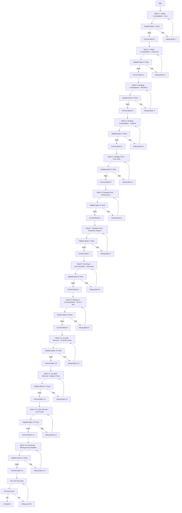
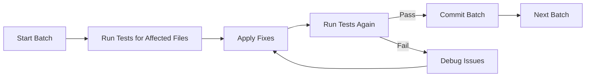

# Test Suite Improvement Implementation Plan

## Executive Summary

This plan orchestrates the implementation of 150+ deviations identified in `test_file_deviations.md` across 29 test files. The deviations are organized into 9 major categories with varying priority levels.

## Revised Approach: Small Batch Processing

Instead of tackling all files at once, the work is organized into **small batches of 3-5 files per phase**. This approach provides:
- ✅ More manageable work units
- ✅ Faster feedback cycles
- ✅ Easier testing and validation
- ✅ Reduced risk of large-scale failures
- ✅ Better progress tracking

## Issue Categories Overview

| Category | Count | Priority | Impact |
|----------|-------|----------|--------|
| Strategy Classification Errors | 45+ | HIGH | Test performance & correctness |
| Test Naming Inconsistencies | 15+ | HIGH | Test clarity & maintainability |
| Helper Function Duplication | 20+ | MEDIUM | Code maintainability |
| sys.path Modifications | 10+ | MEDIUM | Code quality |
| Import Placement Issues | 5+ | MEDIUM | Code organization |
| Missing Docstrings | 10+ | LOW | Documentation |
| Stray Comments | 5+ | LOW | Code cleanliness |
| Unused Imports | 3+ | LOW | Code cleanliness |
| Documentation Inconsistencies | 10+ | MEDIUM | Test accuracy |

## Implementation Strategy: Batch Processing

### Overview

The work is organized into **12 small batches** of 3-5 files each. Each batch focuses on a specific category of fixes and can be completed independently with minimal risk.

### Batch Structure

Each batch follows this pattern:
1. **Pre-batch validation**: Run tests for affected files
2. **Apply fixes**: Make changes to 3-5 files
3. **Post-batch validation**: Re-run tests to verify no regressions
4. **Commit**: Commit batch if tests pass

### Batch Schedule

#### Batch 1: Helper Consolidation - Core Test Files
**Files**: test_clipping_behavior.py, test_font_properties.py, test_texture_render_mode.py
**Issues**: 8 helper functions to consolidate
**Priority**: HIGH (prerequisite for other work)
**Estimated Time**: Small batch

**Tasks**:
- [ ] test_clipping_behavior.py: Move _has_clipping_container to test_utils.py (2 duplicates)
- [ ] test_font_properties.py: Move _is_code_label and _collect_widget_ids to test_utils.py
- [ ] test_texture_render_mode.py: Move find_images to test_utils.py

#### Batch 2: Helper Consolidation - Advanced Test Files
**Files**: test_shortening_and_coordinate.py, tools/test_analysis/test_coverage_preservation.py
**Issues**: 4 helper functions to consolidate
**Priority**: HIGH (prerequisite for other work)
**Estimated Time**: Small batch

**Tasks**:
- [ ] test_shortening_and_coordinate.py: Move _find_labels_with_refs, _find_labels_with_ref_markup, _get_widget_offset to test_utils.py
- [ ] tools/test_analysis/test_coverage_preservation.py: Move _simulate_coverage_measurement to test_utils.py

#### Batch 3: Strategy Consolidation - Renderer Tests
**Files**: test_kivy_renderer.py, test_padding_properties.py, test_text_properties.py
**Issues**: 14 custom strategies to consolidate
**Priority**: HIGH (prerequisite for other work)
**Estimated Time**: Medium batch

**Tasks**:
- [ ] test_kivy_renderer.py: Move heading_token, paragraph_token, list_item_token, list_token, code_block_token, block_quote_token, image_token, table_cell_token, table_row_token, table_token to test_utils.py
- [ ] test_padding_properties.py: Move padding_single, padding_two, padding_four to test_utils.py
- [ ] test_text_properties.py: Move unicode_errors_strategy to test_utils.py

#### Batch 4: Strategy Consolidation - Analysis Tools
**Files**: tools/test_analysis/test_duplicate_detector.py, tools/test_analysis/test_test_file_parser.py
**Issues**: 2 custom strategies to consolidate
**Priority**: HIGH (prerequisite for other work)
**Estimated Time**: Small batch

**Tasks**:
- [ ] tools/test_analysis/test_duplicate_detector.py: Move duplicate_helper_functions to test_utils.py
- [ ] tools/test_analysis/test_test_file_parser.py: Move rebuild_test_file_strategy to test_utils.py

#### Batch 5: Strategy Classification Fixes - Core Tests
**Files**: test_comment_standardizer.py, test_documentation_compliance.py, test_file_analyzer.py
**Issues**: 8 strategy classification errors
**Priority**: HIGH (test correctness & performance)
**Estimated Time**: Medium batch

**Tasks**:
- [ ] test_comment_standardizer.py: Fix strategy comments (lines 40, 304, 372, 595, 660) - Complex → Combination
- [ ] test_documentation_compliance.py: Fix strategy classification (line 123) - Medium finite → Complex
- [ ] test_file_analyzer.py: Fix strategy type casing and classifications (lines 298, 473, 474, 501)

#### Batch 6: Strategy Classification Fixes - Performance Tests
**Files**: test_performance.py, test_serialization.py, test_shortening_and_coordinate.py
**Issues**: 9 strategy classification errors
**Priority**: HIGH (test correctness & performance)
**Estimated Time**: Medium batch

**Tasks**:
- [ ] test_performance.py: Fix strategy classifications (lines 63, 94, 341, 383) - Complex → Combination
- [ ] test_serialization.py: Fix strategy classification (line 504) - Complex → Combination
- [ ] test_shortening_and_coordinate.py: Fix strategy classifications and max_examples (lines 615, 656, 688, 983, 1324)

#### Batch 7: Strategy Classification Fixes - Rebuild & Analysis
**Files**: test_rebuild_semantics.py, tools/test_analysis/test_assertion_analyzer.py, tools/test_analysis/test_naming_convention_validator.py
**Issues**: 10 strategy classification errors
**Priority**: HIGH (test correctness & performance)
**Estimated Time**: Medium batch

**Tasks**:
- [ ] test_rebuild_semantics.py: Fix max_examples values (lines 311, 520, 775, 822, 869, 944, 990, 1047) - 100 → 50
- [ ] tools/test_analysis/test_assertion_analyzer.py: Fix max_examples values (lines 97, 137) - 100 → 20-50
- [ ] tools/test_analysis/test_naming_convention_validator.py: Fix max_examples values (lines 119, 179) - 100 → 20-50

#### Batch 8: Test Naming & Documentation - Advanced Compatibility
**Files**: test_advanced_compatibility.py, test_color_properties.py
**Issues**: 11 naming and documentation issues
**Priority**: HIGH (test clarity & maintainability)
**Estimated Time**: Medium batch

**Tasks**:
- [ ] test_advanced_compatibility.py: Rename tests and fix docstrings (lines 183, 207, 390, 719, 751, 782, 812, 842, 911, 941)
- [ ] test_color_properties.py: Fix docstring (line 83)

#### Batch 9: Test Naming & Documentation - Font & Text Properties
**Files**: test_font_properties.py, test_text_properties.py
**Issues**: 5 naming and documentation issues
**Priority**: HIGH (test clarity & maintainability)
**Estimated Time**: Small batch

**Tasks**:
- [ ] test_font_properties.py: Rename tests (lines 124, 232) and add verification (line 927)
- [ ] test_text_properties.py: Rename tests and fix docstrings (lines 56, 446, 582)

#### Batch 10: sys.path Removal - Comment & Standardizer Tests
**Files**: test_comment_format.py, test_comment_standardizer.py
**Issues**: 8 sys.path modifications to remove
**Priority**: MEDIUM (code quality)
**Estimated Time**: Medium batch

**Tasks**:
- [ ] test_comment_format.py: Remove sys.path modifications (lines 13, 212, 369, 532) and fix import (line 730)
- [ ] test_comment_standardizer.py: Remove sys.path modifications (lines 15, 857) and fix import (line 861)

#### Batch 11: sys.path Removal - Analysis Tools
**Files**: test_file_analyzer.py, test_strategy_classification.py, tools/test_analysis/test_assertion_analyzer.py, tools/test_analysis/test_code_duplication_minimization.py, tools/test_analysis/test_coverage_preservation.py, tools/test_analysis/test_duplicate_detector.py, tools/test_analysis/test_naming_convention_validator.py, tools/test_analysis/test_test_file_parser.py
**Issues**: 10 sys.path modifications to remove
**Priority**: MEDIUM (code quality)
**Estimated Time**: Medium batch

**Tasks**:
- [ ] test_file_analyzer.py: Remove sys.path modification (line 16) and fix import (line 303)
- [ ] test_strategy_classification.py: Remove sys.path modification (lines 10-12)
- [ ] tools/test_analysis/test_assertion_analyzer.py: Remove sys.path modification (lines 18-21)
- [ ] tools/test_analysis/test_code_duplication_minimization.py: Remove sys.path modification (lines 16-19)
- [ ] tools/test_analysis/test_coverage_preservation.py: Remove sys.path modification (lines 19-21)
- [ ] tools/test_analysis/test_duplicate_detector.py: Remove sys.path modification (lines 15-18)
- [ ] tools/test_analysis/test_naming_convention_validator.py: Remove sys.path modification (lines 17-20)
- [ ] tools/test_analysis/test_test_file_parser.py: Remove sys.path modification (lines 15-18)

#### Batch 12: Code Cleanup - Low Priority Fixes
**Files**: test_core_functionality.py, test_helper_availability.py, test_performance.py, test_shared_infrastructure.py, test_sizing_behavior.py, test_texture_sizing.py, test_text_properties.py
**Issues**: 15+ low-priority issues
**Priority**: LOW (code cleanliness)
**Estimated Time**: Medium batch

**Tasks**:
- [ ] test_core_functionality.py: Remove stray comments (lines 103, 242)
- [ ] test_helper_availability.py: Refactor nested property tests (lines 146-182)
- [ ] test_performance.py: Remove unused imports (lines 12-15) and fix docstring (line 317)
- [ ] test_shared_infrastructure.py: Remove stray comment (line 149)
- [ ] test_sizing_behavior.py: Remove unused imports (lines 11-14)
- [ ] test_texture_sizing.py: Remove unused imports (lines 11-14)
- [ ] test_text_properties.py: Remove stray comment (line 108)

#### Batch 13: Docstrings - Missing Documentation
**Files**: test_comment_standardizer.py
**Issues**: 12 missing docstrings
**Priority**: LOW (documentation)
**Estimated Time**: Small batch

**Tasks**:
- [ ] test_comment_standardizer.py: Add docstrings (lines 91, 109, 170, 198, 238, 418, 469, 504, 536, 708, 773, 802)
- [ ] test_comment_standardizer.py: Remove or properly implement test (line 987)
- [ ] test_padding_properties.py: Remove stray comment (line 78)

## Detailed Task Breakdown by File

### test_advanced_compatibility.py
- [ ] Rename test_font_kerning_change_updates_value → test_font_kerning_change_triggers_rebuild (line 183)
- [ ] Rename test_font_blended_change_updates_value → test_font_blended_change_triggers_rebuild (line 207)
- [ ] Rename test_disabled_change_updates_value → test_disabled_change_triggers_rebuild (line 390)
- [ ] Fix docstring for test_halign_updates_value (line 719)
- [ ] Fix docstring for test_valign_updates_value (line 751)
- [ ] Fix docstring for test_unicode_errors_updates_value (line 782)
- [ ] Fix docstring for test_strip_updates_value (line 812)
- [ ] Fix docstring for test_disabled_color_updates_value (line 842)
- [ ] Fix docstring for test_font_kerning_updates_value (line 911)
- [ ] Fix docstring for test_font_blended_updates_value (line 941)

### test_clipping_behavior.py
- [ ] Move _has_clipping_container to test_utils.py (lines 19-33, 157-171)

### test_color_properties.py
- [ ] Fix docstring for test_color_change_updates_value (line 83)

### test_comment_format.py
- [ ] Remove sys.path modification (line 13)
- [ ] Remove redundant sys.path modification in TestCustomValueDocumentation.setup_method (line 212)
- [ ] Remove redundant sys.path modification in TestStrategyTypeConsistency.setup_method (line 369)
- [ ] Remove redundant sys.path modification in TestMachineReadableFormat.setup_method (line 532)
- [ ] Move import from test method to module level (line 730)

### test_comment_standardizer.py
- [ ] Remove sys.path modification (line 15)
- [ ] Fix strategy comment: Complex → Combination (line 40)
- [ ] Add docstring for test_boolean_strategy_comment_generation_consistency (line 91)
- [ ] Add docstring for test_boolean_strategy_detection_accuracy (line 109)
- [ ] Add docstring for test_boolean_strategy_rationale_templates (line 170)
- [ ] Add docstring for test_boolean_strategy_edge_cases (line 198)
- [ ] Add docstring for test_boolean_strategy_integration_with_analysis (line 238)
- [ ] Fix strategy comment: Complex → Combination (line 304)
- [ ] Fix strategy comment: Complex → Combination (line 372)
- [ ] Add docstring for test_finite_strategy_size_classification (line 418)
- [ ] Add docstring for test_finite_strategy_rationale_consistency (line 469)
- [ ] Add docstring for test_safety_checks_and_validation (line 504)
- [ ] Add docstring for test_error_handling_in_backup_operations (line 536)
- [ ] Fix strategy comment: Complex → Combination (line 595)
- [ ] Fix strategy comment: Complex → Combination (line 660)
- [ ] Add docstring for test_performance_rationale_integration_with_standardizer (line 708)
- [ ] Add docstring for test_performance_rationale_enhancement_of_existing_comments (line 773)
- [ ] Add docstring for test_performance_pattern_analysis_across_files (line 802)
- [ ] Remove redundant sys.path modification (line 857)
- [ ] Move import from setup_method to module level (line 861)
- [ ] Remove or properly implement test_backup_and_rollback_functionality (line 987)

### test_core_functionality.py
- [ ] Remove stray comment (line 103)
- [ ] Remove stray comment (line 242)

### test_documentation_compliance.py
- [ ] Fix strategy classification: Medium finite → Complex (line 123)

### test_file_analyzer.py
- [ ] Remove sys.path modification (line 16)
- [ ] Fix strategy type casing: Small finite → small_finite (line 298)
- [ ] Fix strategy classification: Complex → Small finite (line 473)
- [ ] Fix strategy type casing in sampled_from values (line 474)
- [ ] Fix strategy classification: Medium finite → small_finite (line 501)
- [ ] Fix strategy classification: Combination → Small finite (line 501)
- [ ] Move import from test method to module level (line 303)

### test_font_properties.py
- [ ] Move _is_code_label to test_utils.py (lines 38-48)
- [ ] Rename test_font_name_change_updates_value → test_font_name_change_triggers_rebuild (line 124)
- [ ] Rename test_line_height_change_updates_value → test_line_height_change_triggers_rebuild (line 232)
- [ ] Remove duplicate _collect_widget_ids (lines 815-821)
- [ ] Add verification for font_size update in test_rebuild_counter_not_incremented_on_font_size_change (line 927)

### test_helper_availability.py
- [ ] Refactor nested property tests to standalone methods (lines 146-182)

### test_kivy_renderer.py
- [ ] Move heading_token strategy to test_utils.py (lines 24-37)
- [ ] Move paragraph_token strategy to test_utils.py (lines 40-50)
- [ ] Move list_item_token strategy to test_utils.py (lines 53-66)
- [ ] Move list_token strategy to test_utils.py (lines 69-85)
- [ ] Move code_block_token strategy to test_utils.py (lines 88-100)
- [ ] Move block_quote_token strategy to test_utils.py (lines 103-116)
- [ ] Move image_token strategy to test_utils.py (lines 119-132)
- [ ] Move table_cell_token, table_row_token, table_token strategies to test_utils.py (lines 586-651)
- [ ] Fix strategy classification: Complex → Combination (line 189)

### test_padding_properties.py
- [ ] Move padding_single, padding_two, padding_four strategies to test_utils.py (lines 24-33)
- [ ] Remove stray comment (line 78)

### test_performance.py
- [ ] Remove unused imports (lines 12-15)
- [ ] Fix strategy classification: Complex → Combination (line 63)
- [ ] Fix strategy classification: Complex → Combination (line 94)
- [ ] Fix docstring for test_font_name_structure_property_rebuilds_tree (line 317)
- [ ] Fix strategy classification: Complex → Combination (line 341)
- [ ] Fix strategy classification: Complex → Combination (line 383)

### test_rebuild_semantics.py
- [ ] Fix max_examples: 100 → 50 (line 311)
- [ ] Fix max_examples: 100 → 50 (line 520)
- [ ] Fix strategy classification: Complex → Combination, max_examples: 100 → 50 (line 775)
- [ ] Fix strategy classification: Complex → Combination, max_examples: 100 → 50 (line 822)
- [ ] Fix strategy classification: Complex → Combination, max_examples: 100 → 50 (line 869)
- [ ] Fix max_examples: 100 → 50 (line 944)
- [ ] Fix max_examples: 100 → 50 (line 990)
- [ ] Fix max_examples: 100 → 50 (line 1047)

### test_serialization.py
- [ ] Fix strategy classification: Complex → Combination (line 504)

### test_shared_infrastructure.py
- [ ] Remove stray comment (line 149)

### test_shortening_and_coordinate.py
- [ ] Rename test_shorten_change_updates_value → test_shorten_change_triggers_rebuild (line 323)
- [ ] Move _find_labels_with_refs, _find_labels_with_ref_markup, _get_widget_offset to test_utils.py (lines 360-408)
- [ ] Fix strategy classification: Complex → Combination (line 615)
- [ ] Fix strategy classification: Complex → Combination (line 656)
- [ ] Fix strategy classification: Complex → Combination (line 688)
- [ ] Fix strategy classification: Complex → Combination, max_examples: 100 → 50 (line 983)
- [ ] Fix strategy classification: Complex → Combination, max_examples: 100 → 50 (line 1324)

### test_sizing_behavior.py
- [ ] Remove unused imports (lines 11-14)

### test_strategy_classification.py
- [ ] Remove sys.path modification (lines 10-12)
- [ ] Clarify comment rationale for test_boolean_strategy_classification (line 28)

### test_text_properties.py
- [ ] Move unicode_errors_strategy to test_utils.py (line 21)
- [ ] Fix docstring for test_text_size_change_updates_value (line 56)
- [ ] Remove stray comment (line 108)
- [ ] Rename test_unicode_errors_change_updates_value → test_unicode_errors_change_triggers_rebuild (line 446)
- [ ] Rename test_strip_change_updates_value → test_strip_change_triggers_rebuild (line 582)

### test_texture_render_mode.py
- [ ] Move find_images helper to test_utils.py (lines 23-31)

### test_texture_sizing.py
- [ ] Remove unused imports (lines 11-14)

### tools/test_analysis/test_assertion_analyzer.py
- [ ] Remove sys.path modification (lines 18-21)
- [ ] Fix max_examples: 100 → 20-50 (line 97)
- [ ] Fix max_examples: 100 → 50 (line 137)

### tools/test_analysis/test_code_duplication_minimization.py
- [ ] Remove sys.path modification (lines 16-19)

### tools/test_analysis/test_coverage_preservation.py
- [ ] Remove sys.path modification (lines 19-21)
- [ ] Move _simulate_coverage_measurement to test_utils.py (lines 288-314)

### tools/test_analysis/test_duplicate_detector.py
- [ ] Remove sys.path modification (lines 15-18)
- [ ] Move duplicate_helper_functions strategy to test_utils.py (lines 30-94)

### tools/test_analysis/test_naming_convention_validator.py
- [ ] Remove sys.path modification (lines 17-20)
- [ ] Fix max_examples: 100 → 50 (line 119)
- [ ] Fix max_examples: 100 → 20-50 (line 179)

### tools/test_analysis/test_test_file_parser.py
- [ ] Remove sys.path modification (lines 15-18)
- [ ] Move rebuild_test_file_strategy to test_utils.py (lines 30-84)

## File Summary

| File | Batch | Issues | Type |
|------|-------|--------|------|
| test_advanced_compatibility.py | 8 | 11 | Naming & Documentation |
| test_clipping_behavior.py | 1 | 2 | Helper Consolidation |
| test_color_properties.py | 8 | 1 | Documentation |
| test_comment_format.py | 10 | 5 | sys.path & Imports |
| test_comment_standardizer.py | 5, 10, 13 | 20 | Strategy, sys.path, Docstrings |
| test_core_functionality.py | 12 | 2 | Stray Comments |
| test_documentation_compliance.py | 5 | 1 | Strategy Classification |
| test_file_analyzer.py | 5, 11 | 6 | Strategy, sys.path, Imports |
| test_font_properties.py | 1, 9 | 5 | Helpers, Naming, Verification |
| test_helper_availability.py | 12 | 1 | Nested Tests |
| test_kivy_renderer.py | 3 | 11 | Strategy Consolidation |
| test_padding_properties.py | 3, 13 | 5 | Strategy, Stray Comments |
| test_performance.py | 6, 12 | 7 | Strategy, Imports, Documentation |
| test_rebuild_semantics.py | 7 | 8 | Strategy Classification |
| test_serialization.py | 6 | 1 | Strategy Classification |
| test_shared_infrastructure.py | 12 | 1 | Stray Comments |
| test_shortening_and_coordinate.py | 2, 6, 9 | 8 | Helpers, Strategy, Naming |
| test_sizing_behavior.py | 12 | 1 | Unused Imports |
| test_strategy_classification.py | 11 | 2 | sys.path |
| test_text_properties.py | 3, 9, 12 | 6 | Strategy, Naming, Stray Comments |
| test_texture_render_mode.py | 1 | 1 | Helper Consolidation |
| test_texture_sizing.py | 12 | 1 | Unused Imports |
| tools/test_analysis/test_assertion_analyzer.py | 7, 11 | 3 | Strategy, sys.path |
| tools/test_analysis/test_code_duplication_minimization.py | 11 | 1 | sys.path |
| tools/test_analysis/test_coverage_preservation.py | 2, 11 | 2 | Helpers, sys.path |
| tools/test_analysis/test_duplicate_detector.py | 4, 11 | 2 | Strategy, sys.path |
| tools/test_analysis/test_naming_convention_validator.py | 7, 11 | 3 | Strategy, sys.path |
| tools/test_analysis/test_test_file_parser.py | 4, 11 | 2 | Strategy, sys.path |

**Total**: 29 files, 150+ issues across 13 batches

## Implementation Workflow

### Batch Execution Pattern

Each batch follows this consistent pattern:

### Benefits of Batch Approach

1. **Fast Feedback**: Test 3-5 files at a time, not 29
2. **Easy Rollback**: Revert a single batch if needed
3. **Progress Tracking**: Clear milestones (13 batches)
4. **Reduced Risk**: Small changes, isolated failures
5. **Parallelizable**: Some batches could be done independently

## Risk Assessment

### High Risk Changes
- **Test Renaming**: May break external references or CI configurations
- **Helper Function Consolidation**: May affect imports and require careful testing
- **Strategy Classification Fixes**: May affect test coverage if max_examples reduced

### Medium Risk Changes
- **sys.path Removal**: May break imports if package structure not properly set up
- **Import Placement**: May affect test execution order or dependencies

### Low Risk Changes
- **Docstring Updates**: Pure documentation changes
- **Comment Removals**: Cosmetic changes
- **Unused Import Removal**: Should not affect functionality

## Testing Strategy

### Before Implementation
1. Run full test suite to establish baseline
2. Document any pre-existing failures
3. Create backup of test files

### During Implementation
1. Implement changes in phases
2. Run affected tests after each phase
3. Verify no regressions introduced

### After Implementation
1. Run full test suite
2. Verify all tests pass
3. Run comment validation tools
4. Check for any remaining deviations

## Rollback Plan

If issues arise during implementation:
1. Use git to revert specific files
2. Restore from backup if needed
3. Revert by phase if necessary
4. Document issues for future reference

## Success Criteria

- [ ] All 150+ deviations addressed
- [ ] Test suite passes with no regressions
- [ ] No sys.path modifications remain
- [ ] All helper functions consolidated in test_utils.py
- [ ] All custom strategies consolidated in test_utils.py
- [ ] All strategy classifications correct
- [ ] All test names match behavior
- [ ] All docstrings accurate
- [ ] No unused imports
- [ ] No stray comments
- [ ] All imports at module level
- [ ] All nested tests refactored

## Timeline Considerations

### Batch Execution Order

The 13 batches are ordered by dependency and priority:

**Foundation Batches (1-4)** - Must complete first
- Batches 1-2: Helper consolidation (prerequisite for other work)
- Batches 3-4: Strategy consolidation (prerequisite for other work)

**High-Priority Batches (5-7)** - Most impactful changes
- Batches 5-7: Strategy classification fixes (test correctness & performance)

**Medium-Priority Batches (8-11)** - Code quality improvements
- Batches 8-9: Test naming and documentation fixes
- Batches 10-11: sys.path removal and import fixes

**Low-Priority Batches (12-13)** - Polishing and cleanup
- Batches 12-13: Code cleanup and docstrings

### Parallel Execution Opportunities

Some batches can be executed in parallel if desired:
- **Batches 1 & 2**: Independent helper consolidation
- **Batches 3 & 4**: Independent strategy consolidation
- **Batches 5, 6, & 7**: Independent strategy fixes
- **Batches 8 & 9**: Independent naming fixes
- **Batches 10 & 11**: Independent sys.path removal
- **Batches 12 & 13**: Independent cleanup

### Recommended Execution

**Sequential Approach** (Recommended)
- Execute batches 1-13 in order
- Test and commit each batch before proceeding
- Minimal risk, easy to debug

**Parallel Approach** (Advanced)
- Execute independent batches in parallel
- Merge branches after validation
- Faster completion but requires coordination

### Estimated Batch Sizes

| Batch | Files | Issues | Priority | Complexity |
|-------|-------|--------|----------|------------|
| 1 | 3 | 8 helpers | HIGH | Small |
| 2 | 2 | 4 helpers | HIGH | Small |
| 3 | 3 | 14 strategies | HIGH | Medium |
| 4 | 2 | 2 strategies | HIGH | Small |
| 5 | 3 | 8 strategy fixes | HIGH | Medium |
| 6 | 3 | 9 strategy fixes | HIGH | Medium |
| 7 | 3 | 10 strategy fixes | HIGH | Medium |
| 8 | 2 | 11 naming/docs | HIGH | Medium |
| 9 | 2 | 5 naming/docs | HIGH | Small |
| 10 | 2 | 8 sys.path | MEDIUM | Medium |
| 11 | 8 | 10 sys.path | MEDIUM | Medium |
| 12 | 7 | 15+ cleanup | LOW | Medium |
| 13 | 1 | 12 docstrings | LOW | Small |
