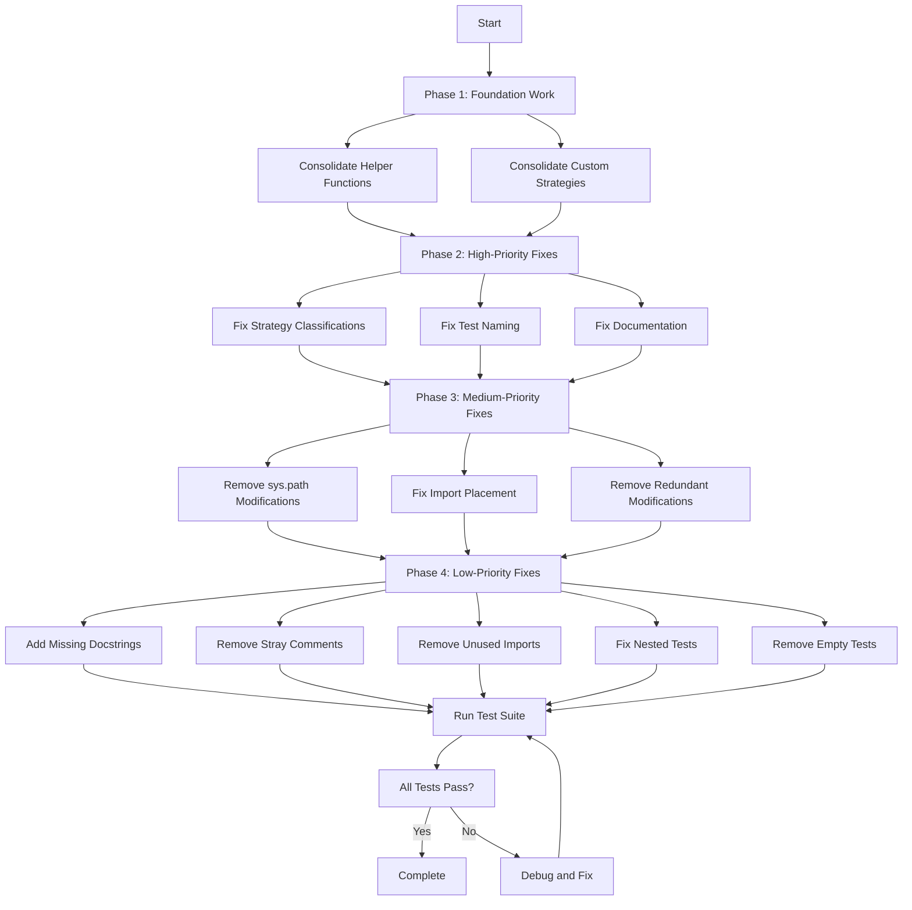

# Test Suite Improvement Implementation Plan

## Executive Summary

This plan orchestrates the implementation of 150+ deviations identified in `test_file_deviations.md` across 29 test files. The deviations are organized into 9 major categories with varying priority levels.

## Issue Categories Overview

| Category | Count | Priority | Impact |
|----------|-------|----------|--------|
| Strategy Classification Errors | 45+ | HIGH | Test performance & correctness |
| Test Naming Inconsistencies | 15+ | HIGH | Test clarity & maintainability |
| Helper Function Duplication | 20+ | MEDIUM | Code maintainability |
| sys.path Modifications | 10+ | MEDIUM | Code quality |
| Import Placement Issues | 5+ | MEDIUM | Code organization |
| Missing Docstrings | 10+ | LOW | Documentation |
| Stray Comments | 5+ | LOW | Code cleanliness |
| Unused Imports | 3+ | LOW | Code cleanliness |
| Documentation Inconsistencies | 10+ | MEDIUM | Test accuracy |

## Implementation Strategy

### Phase 1: Foundation Work (Prerequisites)

**Task 1.1: Consolidate Helper Functions**
- **Goal**: Move all duplicate helper functions to `test_utils.py`
- **Files Affected**: 
  - `test_clipping_behavior.py` (_has_clipping_container)
  - `test_font_properties.py` (_is_code_label, _collect_widget_ids)
  - `test_shortening_and_coordinate.py` (_find_labels_with_refs, _find_labels_with_ref_markup, _get_widget_offset)
  - `test_texture_render_mode.py` (find_images)
  - `tools/test_analysis/test_coverage_preservation.py` (_simulate_coverage_measurement)
- **Approach**: Manual consolidation to ensure proper testing of helpers
- **Estimated Tasks**: 6 helper functions to consolidate

**Task 1.2: Consolidate Custom Hypothesis Strategies**
- **Goal**: Move all custom strategies to `test_utils.py`
- **Files Affected**:
  - `test_kivy_renderer.py` (heading_token, paragraph_token, list_item_token, list_token, code_block_token, block_quote_token, image_token, table_cell_token, table_row_token, table_token)
  - `test_padding_properties.py` (padding_single, padding_two, padding_four)
  - `test_text_properties.py` (unicode_errors_strategy)
  - `tools/test_analysis/test_duplicate_detector.py` (duplicate_helper_functions)
  - `tools/test_analysis/test_test_file_parser.py` (rebuild_test_file_strategy)
- **Approach**: Manual consolidation with proper imports
- **Estimated Tasks**: 15+ strategies to consolidate

### Phase 2: High-Priority Fixes (Test Correctness & Performance)

**Task 2.1: Fix Strategy Classifications**
- **Goal**: Correct strategy type comments and max_examples values
- **Pattern**: Replace incorrect "Complex" with "Combination" or correct finite classifications
- **Files Affected**:
  - `test_comment_standardizer.py` (lines 40, 304, 372, 595, 660)
  - `test_documentation_compliance.py` (line 123)
  - `test_file_analyzer.py` (lines 298, 473, 501)
  - `test_performance.py` (lines 63, 94, 341, 383)
  - `test_rebuild_semantics.py` (lines 311, 520, 775, 822, 869, 944, 990, 1047)
  - `test_serialization.py` (line 504)
  - `test_shortening_and_coordinate.py` (lines 615, 656, 688, 983, 1324)
  - `tools/test_analysis/test_assertion_analyzer.py` (lines 97, 137)
  - `tools/test_analysis/test_naming_convention_validator.py` (lines 119, 179)
- **Approach**: Semi-automated with manual review
- **Estimated Tasks**: 25+ strategy fixes

**Task 2.2: Fix Test Naming Conventions**
- **Goal**: Align test names with actual behavior (rebuild vs. value update)
- **Pattern**: Rename tests to use `triggers_rebuild` or `updates_value` consistently
- **Files Affected**:
  - `test_advanced_compatibility.py` (lines 183, 207, 390, 719, 751, 782, 812, 842, 911, 941)
  - `test_font_properties.py` (lines 124, 232)
  - `test_shortening_and_coordinate.py` (line 323)
  - `test_text_properties.py` (lines 56, 446, 582)
- **Approach**: Manual review and renaming
- **Estimated Tasks**: 15+ test renames

**Task 2.3: Fix Documentation Inconsistencies**
- **Goal**: Align docstrings with actual test behavior
- **Files Affected**:
  - `test_advanced_compatibility.py` (lines 719, 751, 782, 812, 842, 911, 941)
  - `test_color_properties.py` (line 83)
  - `test_performance.py` (line 317)
- **Approach**: Manual review and docstring updates
- **Estimated Tasks**: 10+ docstring fixes

### Phase 3: Medium-Priority Fixes (Code Quality)

**Task 3.1: Remove sys.path Modifications**
- **Goal**: Replace runtime sys.path modifications with proper package structure
- **Files Affected**:
  - `test_comment_format.py` (lines 13, 212, 369, 532, 730)
  - `test_comment_standardizer.py` (lines 15, 857)
  - `test_file_analyzer.py` (line 16)
  - `test_strategy_classification.py` (lines 10-12)
  - `tools/test_analysis/test_assertion_analyzer.py` (lines 18-21)
  - `tools/test_analysis/test_code_duplication_minimization.py` (lines 16-19)
  - `tools/test_analysis/test_coverage_preservation.py` (lines 19-21)
  - `tools/test_analysis/test_duplicate_detector.py` (lines 15-18)
  - `tools/test_analysis/test_naming_convention_validator.py` (lines 17-20)
  - `tools/test_analysis/test_test_file_parser.py` (lines 15-18)
- **Approach**: 
  1. Ensure tools directory is a proper Python package
  2. Add __init__.py if missing
  3. Update imports to use absolute imports
- **Estimated Tasks**: 10+ files to update

**Task 3.2: Fix Import Placement**
- **Goal**: Move imports from test methods to module level
- **Files Affected**:
  - `test_comment_format.py` (line 730)
  - `test_comment_standardizer.py` (line 861)
  - `test_file_analyzer.py` (line 303)
- **Approach**: Move imports to top of file
- **Estimated Tasks**: 3+ import moves

**Task 3.3: Remove Redundant sys.path Modifications**
- **Goal**: Remove duplicate sys.path modifications in setup_method
- **Files Affected**:
  - `test_comment_format.py` (lines 212, 369, 532)
  - `test_comment_standardizer.py` (line 857)
- **Approach**: Remove redundant modifications
- **Estimated Tasks**: 4+ removals

### Phase 4: Low-Priority Fixes (Code Cleanliness)

**Task 4.1: Add Missing Docstrings**
- **Goal**: Add docstrings to test methods that are missing them
- **Files Affected**:
  - `test_comment_standardizer.py` (lines 91, 109, 170, 198, 238, 418, 469, 504, 536, 708, 773, 802)
- **Approach**: Add descriptive docstrings
- **Estimated Tasks**: 12+ docstrings

**Task 4.2: Remove Stray Comments**
- **Goal**: Remove comments that don't correspond to @settings decorators
- **Files Affected**:
  - `test_core_functionality.py` (lines 103, 242)
  - `test_padding_properties.py` (line 78)
  - `test_shared_infrastructure.py` (line 149)
  - `test_text_properties.py` (line 108)
- **Approach**: Remove misplaced comments
- **Estimated Tasks**: 5+ comment removals

**Task 4.3: Remove Unused Imports**
- **Goal**: Remove imports that are never used
- **Files Affected**:
  - `test_performance.py` (lines 12-15)
  - `test_sizing_behavior.py` (lines 11-14)
  - `test_texture_sizing.py` (lines 11-14)
- **Approach**: Remove unused imports
- **Estimated Tasks**: 3+ import removals

**Task 4.4: Fix Nested Property Tests**
- **Goal**: Refactor nested property tests to standalone methods
- **Files Affected**:
  - `test_helper_availability.py` (lines 146-182)
- **Approach**: Extract nested functions to proper test methods
- **Estimated Tasks**: 4+ test refactors

**Task 4.5: Remove Empty/Stub Tests**
- **Goal**: Remove or properly implement tests that only contain `assert True`
- **Files Affected**:
  - `test_comment_standardizer.py` (line 987)
- **Approach**: Remove or implement properly
- **Estimated Tasks**: 1 test

## Detailed Task Breakdown by File

### test_advanced_compatibility.py
- [ ] Rename test_font_kerning_change_updates_value → test_font_kerning_change_triggers_rebuild (line 183)
- [ ] Rename test_font_blended_change_updates_value → test_font_blended_change_triggers_rebuild (line 207)
- [ ] Rename test_disabled_change_updates_value → test_disabled_change_triggers_rebuild (line 390)
- [ ] Fix docstring for test_halign_updates_value (line 719)
- [ ] Fix docstring for test_valign_updates_value (line 751)
- [ ] Fix docstring for test_unicode_errors_updates_value (line 782)
- [ ] Fix docstring for test_strip_updates_value (line 812)
- [ ] Fix docstring for test_disabled_color_updates_value (line 842)
- [ ] Fix docstring for test_font_kerning_updates_value (line 911)
- [ ] Fix docstring for test_font_blended_updates_value (line 941)

### test_clipping_behavior.py
- [ ] Move _has_clipping_container to test_utils.py (lines 19-33, 157-171)

### test_color_properties.py
- [ ] Fix docstring for test_color_change_updates_value (line 83)

### test_comment_format.py
- [ ] Remove sys.path modification (line 13)
- [ ] Remove redundant sys.path modification in TestCustomValueDocumentation.setup_method (line 212)
- [ ] Remove redundant sys.path modification in TestStrategyTypeConsistency.setup_method (line 369)
- [ ] Remove redundant sys.path modification in TestMachineReadableFormat.setup_method (line 532)
- [ ] Move import from test method to module level (line 730)

### test_comment_standardizer.py
- [ ] Remove sys.path modification (line 15)
- [ ] Fix strategy comment: Complex → Combination (line 40)
- [ ] Add docstring for test_boolean_strategy_comment_generation_consistency (line 91)
- [ ] Add docstring for test_boolean_strategy_detection_accuracy (line 109)
- [ ] Add docstring for test_boolean_strategy_rationale_templates (line 170)
- [ ] Add docstring for test_boolean_strategy_edge_cases (line 198)
- [ ] Add docstring for test_boolean_strategy_integration_with_analysis (line 238)
- [ ] Fix strategy comment: Complex → Combination (line 304)
- [ ] Fix strategy comment: Complex → Combination (line 372)
- [ ] Add docstring for test_finite_strategy_size_classification (line 418)
- [ ] Add docstring for test_finite_strategy_rationale_consistency (line 469)
- [ ] Add docstring for test_safety_checks_and_validation (line 504)
- [ ] Add docstring for test_error_handling_in_backup_operations (line 536)
- [ ] Fix strategy comment: Complex → Combination (line 595)
- [ ] Fix strategy comment: Complex → Combination (line 660)
- [ ] Add docstring for test_performance_rationale_integration_with_standardizer (line 708)
- [ ] Add docstring for test_performance_rationale_enhancement_of_existing_comments (line 773)
- [ ] Add docstring for test_performance_pattern_analysis_across_files (line 802)
- [ ] Remove redundant sys.path modification (line 857)
- [ ] Move import from setup_method to module level (line 861)
- [ ] Remove or properly implement test_backup_and_rollback_functionality (line 987)

### test_core_functionality.py
- [ ] Remove stray comment (line 103)
- [ ] Remove stray comment (line 242)

### test_documentation_compliance.py
- [ ] Fix strategy classification: Medium finite → Complex (line 123)

### test_file_analyzer.py
- [ ] Remove sys.path modification (line 16)
- [ ] Fix strategy type casing: Small finite → small_finite (line 298)
- [ ] Fix strategy classification: Complex → Small finite (line 473)
- [ ] Fix strategy type casing in sampled_from values (line 474)
- [ ] Fix strategy classification: Medium finite → small_finite (line 501)
- [ ] Fix strategy classification: Combination → Small finite (line 501)
- [ ] Move import from test method to module level (line 303)

### test_font_properties.py
- [ ] Move _is_code_label to test_utils.py (lines 38-48)
- [ ] Rename test_font_name_change_updates_value → test_font_name_change_triggers_rebuild (line 124)
- [ ] Rename test_line_height_change_updates_value → test_line_height_change_triggers_rebuild (line 232)
- [ ] Remove duplicate _collect_widget_ids (lines 815-821)
- [ ] Add verification for font_size update in test_rebuild_counter_not_incremented_on_font_size_change (line 927)

### test_helper_availability.py
- [ ] Refactor nested property tests to standalone methods (lines 146-182)

### test_kivy_renderer.py
- [ ] Move heading_token strategy to test_utils.py (lines 24-37)
- [ ] Move paragraph_token strategy to test_utils.py (lines 40-50)
- [ ] Move list_item_token strategy to test_utils.py (lines 53-66)
- [ ] Move list_token strategy to test_utils.py (lines 69-85)
- [ ] Move code_block_token strategy to test_utils.py (lines 88-100)
- [ ] Move block_quote_token strategy to test_utils.py (lines 103-116)
- [ ] Move image_token strategy to test_utils.py (lines 119-132)
- [ ] Move table_cell_token, table_row_token, table_token strategies to test_utils.py (lines 586-651)
- [ ] Fix strategy classification: Complex → Combination (line 189)

### test_padding_properties.py
- [ ] Move padding_single, padding_two, padding_four strategies to test_utils.py (lines 24-33)
- [ ] Remove stray comment (line 78)

### test_performance.py
- [ ] Remove unused imports (lines 12-15)
- [ ] Fix strategy classification: Complex → Combination (line 63)
- [ ] Fix strategy classification: Complex → Combination (line 94)
- [ ] Fix docstring for test_font_name_structure_property_rebuilds_tree (line 317)
- [ ] Fix strategy classification: Complex → Combination (line 341)
- [ ] Fix strategy classification: Complex → Combination (line 383)

### test_rebuild_semantics.py
- [ ] Fix max_examples: 100 → 50 (line 311)
- [ ] Fix max_examples: 100 → 50 (line 520)
- [ ] Fix strategy classification: Complex → Combination, max_examples: 100 → 50 (line 775)
- [ ] Fix strategy classification: Complex → Combination, max_examples: 100 → 50 (line 822)
- [ ] Fix strategy classification: Complex → Combination, max_examples: 100 → 50 (line 869)
- [ ] Fix max_examples: 100 → 50 (line 944)
- [ ] Fix max_examples: 100 → 50 (line 990)
- [ ] Fix max_examples: 100 → 50 (line 1047)

### test_serialization.py
- [ ] Fix strategy classification: Complex → Combination (line 504)

### test_shared_infrastructure.py
- [ ] Remove stray comment (line 149)

### test_shortening_and_coordinate.py
- [ ] Rename test_shorten_change_updates_value → test_shorten_change_triggers_rebuild (line 323)
- [ ] Move _find_labels_with_refs, _find_labels_with_ref_markup, _get_widget_offset to test_utils.py (lines 360-408)
- [ ] Fix strategy classification: Complex → Combination (line 615)
- [ ] Fix strategy classification: Complex → Combination (line 656)
- [ ] Fix strategy classification: Complex → Combination (line 688)
- [ ] Fix strategy classification: Complex → Combination, max_examples: 100 → 50 (line 983)
- [ ] Fix strategy classification: Complex → Combination, max_examples: 100 → 50 (line 1324)

### test_sizing_behavior.py
- [ ] Remove unused imports (lines 11-14)

### test_strategy_classification.py
- [ ] Remove sys.path modification (lines 10-12)
- [ ] Clarify comment rationale for test_boolean_strategy_classification (line 28)

### test_text_properties.py
- [ ] Move unicode_errors_strategy to test_utils.py (line 21)
- [ ] Fix docstring for test_text_size_change_updates_value (line 56)
- [ ] Remove stray comment (line 108)
- [ ] Rename test_unicode_errors_change_updates_value → test_unicode_errors_change_triggers_rebuild (line 446)
- [ ] Rename test_strip_change_updates_value → test_strip_change_triggers_rebuild (line 582)

### test_texture_render_mode.py
- [ ] Move find_images helper to test_utils.py (lines 23-31)

### test_texture_sizing.py
- [ ] Remove unused imports (lines 11-14)

### tools/test_analysis/test_assertion_analyzer.py
- [ ] Remove sys.path modification (lines 18-21)
- [ ] Fix max_examples: 100 → 20-50 (line 97)
- [ ] Fix max_examples: 100 → 50 (line 137)

### tools/test_analysis/test_code_duplication_minimization.py
- [ ] Remove sys.path modification (lines 16-19)

### tools/test_analysis/test_coverage_preservation.py
- [ ] Remove sys.path modification (lines 19-21)
- [ ] Move _simulate_coverage_measurement to test_utils.py (lines 288-314)

### tools/test_analysis/test_duplicate_detector.py
- [ ] Remove sys.path modification (lines 15-18)
- [ ] Move duplicate_helper_functions strategy to test_utils.py (lines 30-94)

### tools/test_analysis/test_naming_convention_validator.py
- [ ] Remove sys.path modification (lines 17-20)
- [ ] Fix max_examples: 100 → 50 (line 119)
- [ ] Fix max_examples: 100 → 20-50 (line 179)

### tools/test_analysis/test_test_file_parser.py
- [ ] Remove sys.path modification (lines 15-18)
- [ ] Move rebuild_test_file_strategy to test_utils.py (lines 30-84)

## Implementation Workflow

## Risk Assessment

### High Risk Changes
- **Test Renaming**: May break external references or CI configurations
- **Helper Function Consolidation**: May affect imports and require careful testing
- **Strategy Classification Fixes**: May affect test coverage if max_examples reduced

### Medium Risk Changes
- **sys.path Removal**: May break imports if package structure not properly set up
- **Import Placement**: May affect test execution order or dependencies

### Low Risk Changes
- **Docstring Updates**: Pure documentation changes
- **Comment Removals**: Cosmetic changes
- **Unused Import Removal**: Should not affect functionality

## Testing Strategy

### Before Implementation
1. Run full test suite to establish baseline
2. Document any pre-existing failures
3. Create backup of test files

### During Implementation
1. Implement changes in phases
2. Run affected tests after each phase
3. Verify no regressions introduced

### After Implementation
1. Run full test suite
2. Verify all tests pass
3. Run comment validation tools
4. Check for any remaining deviations

## Rollback Plan

If issues arise during implementation:
1. Use git to revert specific files
2. Restore from backup if needed
3. Revert by phase if necessary
4. Document issues for future reference

## Success Criteria

- [ ] All 150+ deviations addressed
- [ ] Test suite passes with no regressions
- [ ] No sys.path modifications remain
- [ ] All helper functions consolidated in test_utils.py
- [ ] All custom strategies consolidated in test_utils.py
- [ ] All strategy classifications correct
- [ ] All test names match behavior
- [ ] All docstrings accurate
- [ ] No unused imports
- [ ] No stray comments
- [ ] All imports at module level
- [ ] All nested tests refactored

## Timeline Considerations

The work should be approached systematically:
- **Phase 1**: Foundation work (prerequisite for other phases)
- **Phase 2**: High-priority fixes (most impactful)
- **Phase 3**: Medium-priority fixes (code quality)
- **Phase 4**: Low-priority fixes (polishing)

Each phase should be completed and tested before moving to the next phase to minimize risk and enable easy rollback if needed.
